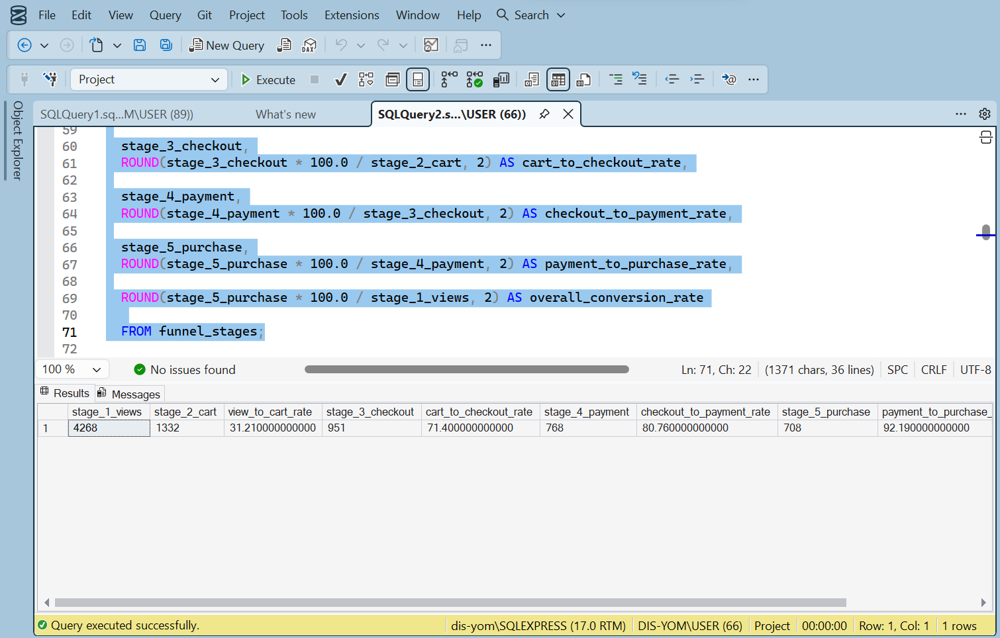
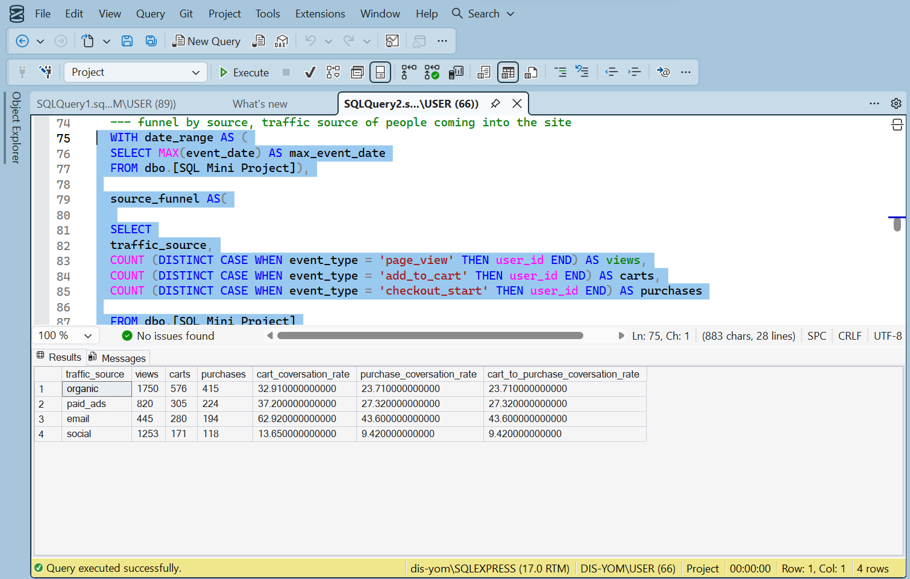
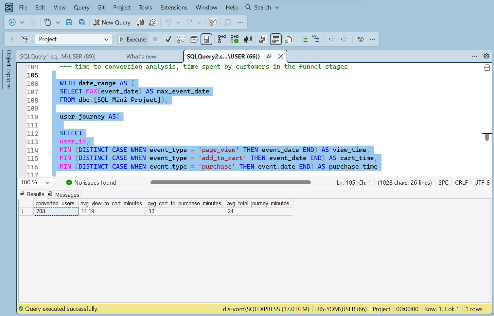
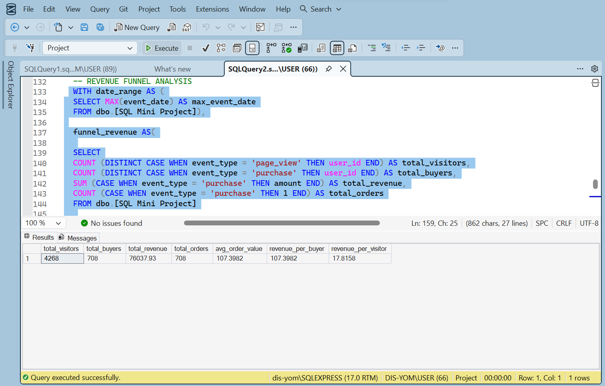

# E-commerce Funnel Analysis Using SQL

## Project Overview

This project analyses an e-commerce customer journey using Microsoft SQL Server and SQL Server Management Studio (SSMS). The aim was to understand how users move through the conversion funnel, identify where users drop off, compare performance across acquisition sources, measure the time taken to convert, and analyse revenue generated at each stage.

The project also demonstrates the use of SQL for data validation, business-rule checks, and structured investigation.

## Business Questions

The analysis focused on the following questions:

1. What percentage of users progress through each stage of the funnel?
2. At which stage does the highest drop-off occur?
3. Which traffic or acquisition sources generate the strongest conversion rates?
4. How long does it take users to move from their first interaction to conversion?
5. How much revenue is generated by converted users?
6. Are there missing, duplicated, or inconsistent records that could affect the results?

## Tools Used

* Microsoft SQL Server
* SQL Server Management Studio
* SQL
* CSV data import

## SQL Skills Demonstrated

* `SELECT` statements
* `WHERE` filtering
* `CASE` expressions
* Aggregate functions
* `GROUP BY`
* `HAVING`
* Common Table Expressions
* `INNER JOIN` and `LEFT JOIN`
* Date functions
* Data-type conversion
* Aliases
* Null checks
* Duplicate-record checks
* Conversion-rate calculations
* Revenue calculations

## Analysis Performed

### 1. Conversion Rate Through the Funnel

The first section measures how users progress through the main funnel stages. It calculates the number of users reaching each stage and the percentage that continue to the next stage.

This helps identify the points where the largest number of users abandon the process.

### 2. Funnel Performance by Source

Users were grouped by their traffic or acquisition source to compare funnel performance across channels.

The analysis helps determine which sources bring in users who are more likely to complete the desired conversion action.

### 3. Time-to-Conversion Analysis

This section measures the time between a user’s initial interaction and completed conversion.

The analysis helps show whether users convert quickly or require a longer decision period. It can also support improvements to follow-up communication and campaign timing.

### 4. Revenue Funnel Analysis

The revenue analysis connects completed conversions with transaction or order values.

It was used to calculate revenue generated by converted users and compare financial performance across relevant segments.

## Data-Quality Checks

Before interpreting the results, I used SQL to review the data for issues that could affect the analysis.

The checks included:

* Missing values in important fields
* Duplicate identifiers or event records
* Invalid or inconsistent dates
* Unmatched records across related tables
* Incorrect data types
* Unexpected funnel-stage sequences
* Revenue values that were missing or inconsistent

These checks helped confirm whether the records met the expected business rules.

## Repository Structure

```text
ecommerce-funnel-analysis-sql/
├── README.md
├── ecommerce_funnel_analysis.sql
├── user_events.csv
├── conversion_rate_results.png
├── funnel_by_source_results.png
├── time_to_conversion_results.png
└── revenue_funnel_results.png
```

## How to Review the Project

1. Open `ecommerce_funnel_analysis.sql`.
2. Review the project header and comments separating each analysis section.
3. Run the queries in Microsoft SQL Server or a compatible SQL environment.
4. Review the screenshots folder for sample outputs from SSMS.

## Key Learning Outcomes

This project strengthened my ability to:

* Translate business questions into SQL queries
* Structure multi-stage analysis using CTEs
* Validate data before drawing conclusions
* Compare performance across user segments
* Calculate funnel conversion rates
* Analyse time-based customer behaviour
* Connect operational activity to revenue outcomes
* Document SQL analysis clearly for review

## Sample Results

### Conversion Rate Through the Funnel



### Funnel Performance by Source



### Time-to-Conversion Analysis



### Revenue Funnel Analysis



## Notes

The source CSV files were imported into SQL Server and analysed in SSMS. The main analysis is contained in one SQL file, with comments separating each section for readability.


## Author

**Toyeeb Abayomi Olayiwola**
